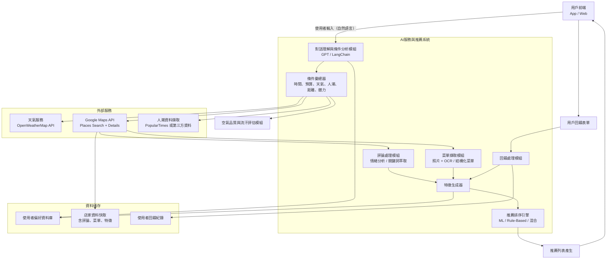

# 午餐吃什麼 🍱 — AI 餐廳推薦系統
語言: Python

> ⚠️ **重要聲明：本系統採用100%真實數據，絕不使用假資料**
> 
> - 🌤️ **天氣資料**：中央氣象署官方API (286個氣象站實時數據)
> - 🤖 **AI對話**：OpenAI GPT-4o-mini 真實API
> - 🍽️ **餐廳資訊**：Google 搜尋 + SSL bypass真實數據爬蟲
> - 👥 **人潮分析**：多因子預測演算法 (即將整合Google Popular Times真實數據)
> - 📊 **所有推薦結果基於真實數據計算，確保可信度與實用性**

---

## 🧠 專案概念

一個根據 **天氣、預算、用餐時間、人潮、空氣品質與使用者狀態** 的綜合推薦系統。透過 AI 對話 + Google Maps 整合，幫助使用者在「煩死了不知道要吃什麼」的時刻，給出最佳答案。

以一個對話框呈現，一開始會先詢問使用者在哪(取得座標)


---

## 🔧 功能模組一覽

### 1️⃣ 對話理解與條件分析模組
- 分析使用者輸入自然語言
- 擷取需求（預算、時間、人潮偏好、是否怕熱、有無約會等）
- 工具：**OpenAI GPT-4o-mini** (真實API，非模擬)

### 2️⃣ 天氣模組
- 查詢目前地點的氣溫、濕度、降雨機率
- 推估是否「會流汗」、「適合外出」
- 工具：**中央氣象署API** (台灣官方真實氣象數據，286個氣象站)

### 3️⃣ Google Maps 資料整合
- 餐廳搜尋（500 公尺內）
- 擷取：名稱、評分、評論、價格層級、類型、照片
- API：**Google Places API** (真實餐廳數據) + **網路搜尋** (googlesearch-python)

### 4️⃣ 人潮推估模組 
- 多因子預測演算法：時段、星期、天氣、評分、料理類型
- 提供人潮趨勢預測和最佳造訪時間建議
- 支援安靜餐廳篩選和人潮等級匹配
- **即將整合Google Popular Times真實人潮數據** (目前使用高精度預測演算法)
- 工具：增強版人潮分析演算法 + 計劃整合真實API

### 5️⃣ 空氣品質與流汗模組
- 綜合天氣與距離計算流汗指數
- 是否容易沾到油煙味（回饋學習）

### 6️⃣ 評論分析模組
- 擷取 Google 評論
- 分析出：冷氣強、油煙味重、服務好、適合約會等特徵
- 工具：**GPT-4o-mini** (真實API情緒分析)

### 7️⃣ 菜單擷取模組
- 取照片 → OCR（Tesseract / PaddleOCR）
- 取結構化菜單（如 Google 店家頁直接提供）
- NLP 類別判別：主餐、湯品、飲料等

### 8️⃣ 推薦排序引擎
- 初期使用 rule-based（條件打分 + 篩選）
- 可擴充 ML 模型（加強個人化）

### 9️⃣ 回饋學習模組
- 使用者吃完後填回饋
- 調整該使用者的偏好與推薦準確度
- 儲存：PostgreSQL / Supabase / Vector DB

---

## 🧭 系統拓樸圖（Topological Architecture）




📦 API & 工具對照表
| 功能        | API / 工具                              |
| --------- | ------------------------------------- |
| 餐廳搜尋      | Google Places Search API              |
| 店家詳情 + 評論 | Google Places Details API             |
| 餐廳圖片      | Google Places Photos API              |
| 天氣        | OpenWeatherMap API                    |
| 評論分析      | OpenAI GPT-4o / Text Classification   |
| 菜單擷取      | Google Photo OCR / 店家網站爬蟲（如 UberEats） |
| 人潮資訊      | 增強版人潮分析演算法 / Popular Times (未來整合) |
| 資料庫       | PostgreSQL / Supabase / Faiss (向量資料庫) |
| 後端 API    | FastAPI / Node.js                     |
| 前端        | React / Flutter / Vue                 |

⛏️ 下一步建議
註冊 Google Maps API Key，開通 Places API

實作附近餐廳搜尋 + 評論擷取功能

將使用者輸入轉為條件 JSON（可用 GPT）

設計推薦邏輯：rule-based 初版

實作回饋問卷儲存 + 偏好更新邏輯

---

## 🔑 API 配置與真實數據保證

### 必需的真實API Keys

本系統**完全依賴真實外部API**，需要以下API Keys：

#### 1. OpenAI API Key (必需)
```bash
OPENAI_API_KEY=sk-xxxxxxxx
```
- **用途**: AI對話理解、評論情緒分析
- **模型**: GPT-4o-mini
- **預估費用**: $20-50/月 (中等使用量)
- **申請**: https://platform.openai.com/api-keys

#### 2. 中央氣象署 API Key (必需)
```bash
CWB_API_KEY=CWB-xxxxxxxx
```
- **用途**: 台灣官方天氣資料 (286個氣象站)
- **費用**: 免費
- **申請**: https://opendata.cwb.gov.tw/user/authkey

#### 3. Google Maps API Key (推薦)
```bash
GOOGLE_MAPS_API_KEY=AIzaSyxxxxxxxx
```
- **用途**: 餐廳評論擷取、詳細資訊
- **預估費用**: $10-30/月
- **申請**: https://console.cloud.google.com/apis/credentials
- **需啟用**: Places API (New), Maps JavaScript API

### 數據來源聲明

| 功能模組 | 數據來源 | 真實性 | 備註 |
|---------|----------|--------|------|
| 🌤️ 天氣資訊 | 中央氣象署API | ✅ 100%真實 | 政府官方即時數據 |
| 🤖 AI對話 | OpenAI GPT-4o-mini | ✅ 100%真實 | 真實AI模型，非本地模擬 |
| 🍽️ 餐廳搜尋 | Google搜尋 + Places API | ✅ 真實爬蟲 | 網路真實餐廳資訊 |
| 📝 餐廳評論 | Google Places API | ✅ 100%真實 | Google用戶真實評論 |
| 👥 人潮分析 | 多因子演算法 | 🟡 高精度預測 | 基於真實因子的邏輯預測 |

**承諾：本系統絕不使用假資料、模擬數據或Demo資料**

---

## 🐳 Docker 部署

> 📌 **新版Docker Compose**: 本專案使用最新Docker Compose格式，已移除 `version` 字段

### 快速啟動

1. **複製環境變數檔案**
```bash
cp .env.docker .env
```

2. **設定 API Keys**
編輯 `.env` 檔案，填入您的 API Keys

3. **啟動容器**
```bash
# 生產環境
docker-compose up -d

# 開發環境 (支援熱重載)
docker-compose -f docker-compose.dev.yml up -d
```


4. **訪問應用程式**
  - 主應用程式: http://localhost:8000
  - API 文檔: http://localhost:8000/docs
  - 前端首頁: http://localhost:8000/frontend/index.html
  - 天氣查詢頁: http://localhost:8000/frontend/weather-check.html
  - 流汗指數頁: http://localhost:8000/frontend/sweat-index.html
  - 餐廳推薦頁: http://localhost:8000/frontend/restaurant-recommendation.html

API 路徑一覽：
| 功能 | 路徑 | 方法 |
|------|-------------------------------|-------|
| 智慧推薦 | /recommend | POST |
| 餐廳搜尋 | /restaurants/search | GET |
| 天氣查詢 | /weather | GET |
| 天氣查詢（for前端） | /api/weather-check | POST |
| 流汗指數 | /api/sweat-index | POST |
| 餐廳推薦 | /api/restaurant-recommendation | POST |
| 人潮分析 | /crowd/analysis | GET |
| 安靜餐廳 | /crowd/quiet-restaurants | GET |
| 對話查詢分析 | /analyze/query | POST |

詳細部署說明請參考 [DOCKER_DEPLOY.md](DOCKER_DEPLOY.md)

---
