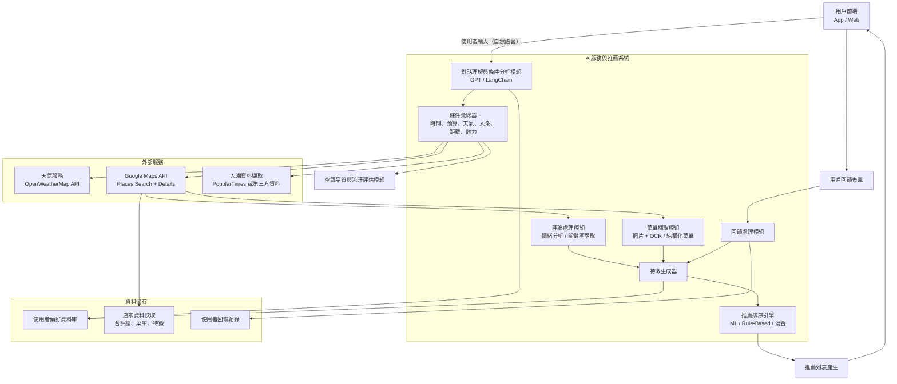

# 午餐吃什麼 🍱 — AI 餐廳推薦系統設計
語言 : Python

---

## 🧠 專案概念

一個根據 **天氣、預算、用餐時間、人潮、空氣品質與使用者狀態** 的綜合推薦系統。透過 AI 對話 + Google Maps 整合，幫助使用者在「煩死了不知道要吃什麼」的時刻，給出最佳答案。

以一個對話框呈現，一開始會先詢問使用者在哪(取得座標)


---

## 🔧 功能模組一覽

### 1️⃣ 對話理解與條件分析模組
- 分析使用者輸入自然語言
- 擷取需求（預算、時間、人潮偏好、是否怕熱、有無約會等）
- 工具：OpenAI GPT-4o / LangChain / Semantic Kernel

### 2️⃣ 天氣模組
- 查詢目前地點的氣溫、濕度、降雨機率
- 推估是否「會流汗」、「適合外出」
- 工具：OpenWeatherMap / 中央氣象局 API

### 3️⃣ Google Maps 資料整合
- 餐廳搜尋（500 公尺內）
- 擷取：名稱、評分、評論、價格層級、類型、照片
- API：Google Places Search / Details / Photos

### 4️⃣ 人潮推估模組
- 使用 Popular Times 資料或群眾貼文熱度
- 預測人潮擁擠度

### 5️⃣ 空氣品質與流汗模組
- 綜合天氣與距離計算流汗指數
- 是否容易沾到油煙味（回饋學習）

### 6️⃣ 評論分析模組
- 擷取 Google 評論
- 分析出：冷氣強、油煙味重、服務好、適合約會等特徵
- 工具：GPT-4o / Text Classification 模型

### 7️⃣ 菜單擷取模組
- 取照片 → OCR（Tesseract / PaddleOCR）
- 取結構化菜單（如 Google 店家頁直接提供）
- NLP 類別判別：主餐、湯品、飲料等

### 8️⃣ 推薦排序引擎
- 初期使用 rule-based（條件打分 + 篩選）
- 可擴充 ML 模型（加強個人化）

### 9️⃣ 回饋學習模組
- 使用者吃完後填回饋
- 調整該使用者的偏好與推薦準確度
- 儲存：PostgreSQL / Supabase / Vector DB

---

## 🧭 系統拓樸圖（Topological Architecture）


```mermaid
graph TD
  A[用戶前端\nApp / Web] -->|使用者輸入（自然語言）| B[對話理解與條件分析模組\nGPT / LangChain]
  
  B --> C[條件彙總器\n時間、預算、天氣、人潮、距離、體力]
  
  C --> D1[天氣服務\nOpenWeatherMap API]
  C --> D2[Google Maps API\nPlaces Search + Details]
  C --> D3[人潮資料擷取\nPopularTimes 或第三方資料]
  C --> D4[空氣品質與流汗評估模組]

  D2 --> E1[評論處理模組\n情緒分析 / 關鍵詞萃取]
  D2 --> E2[菜單擷取模組\n照片 + OCR / 結構化菜單]
  
  E1 --> F[特徵生成器]
  E2 --> F
  
  F --> G[推薦排序引擎\nML / Rule-Based / 混合]
  
  G --> H[推薦列表產生]
  H --> A
  
  A --> I[用戶回饋表單]
  I --> J[回饋處理模組]
  J --> F
  
  subgraph 外部服務
    D1
    D2
    D3
  end

  subgraph AI服務與推薦系統
    B
    C
    E1
    E2
    F
    G
    J
  end

  subgraph 資料儲存
    DB1[使用者偏好資料庫]
    DB2[店家資料快取\n含評論、菜單、特徵]
    DB3[使用者回饋紀錄]
  end

  B --> DB1
  D2 --> DB2
  J --> DB3
  F --> DB1
```


📦 API & 工具對照表
| 功能        | API / 工具                              |
| --------- | ------------------------------------- |
| 餐廳搜尋      | Google Places Search API              |
| 店家詳情 + 評論 | Google Places Details API             |
| 餐廳圖片      | Google Places Photos API              |
| 天氣        | OpenWeatherMap API                    |
| 評論分析      | OpenAI GPT-4o / Text Classification   |
| 菜單擷取      | Google Photo OCR / 店家網站爬蟲（如 UberEats） |
| 人潮資訊      | Google Popular Times / 社群媒體熱度分析       |
| 資料庫       | PostgreSQL / Supabase / Faiss (向量資料庫) |
| 後端 API    | FastAPI / Node.js                     |
| 前端        | React / Flutter / Vue                 |

⛏️ 下一步建議
註冊 Google Maps API Key，開通 Places API

實作附近餐廳搜尋 + 評論擷取功能

將使用者輸入轉為條件 JSON（可用 GPT）

設計推薦邏輯：rule-based 初版

實作回饋問卷儲存 + 偏好更新邏輯

---

## 🐳 Docker 部署

### 快速啟動

1. **複製環境變數檔案**
```bash
cp .env.docker .env
```

2. **設定 API Keys**
編輯 `.env` 檔案，填入您的 API Keys

3. **啟動容器**
```bash
# 生產環境
docker-compose up -d

# 開發環境 (支援熱重載)
docker-compose -f docker-compose.dev.yml up -d
```

4. **訪問應用程式**
- 主應用程式: http://localhost:8000
- API 文檔: http://localhost:8000/docs

詳細部署說明請參考 [DOCKER_DEPLOY.md](DOCKER_DEPLOY.md)

---
